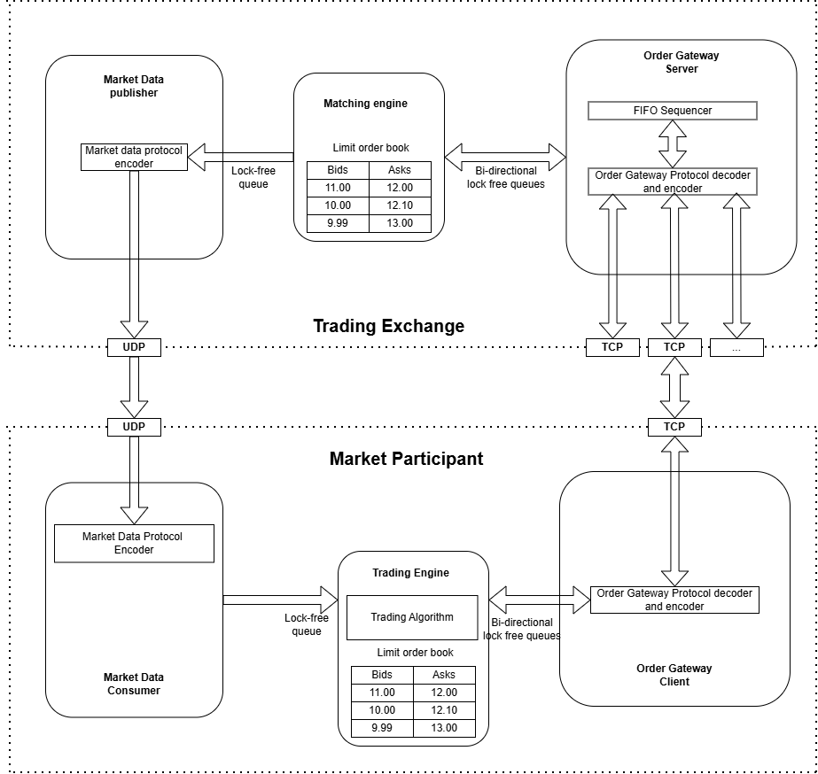

## 1. Basic components overview

Architecture diagram ispired by book "Building Low Latency Applications in C++" by Sourav Ghosh

### Market Data Publisher

Broadcasts low-latency market data (ticks, order book updates) to downstream components.

### Matching Engine

Core component responsible for ultra-low-latency order matching and order book state management.

### Order Gateway Server

Handles inbound client orders, performs minimal validation, and forwards them to the Matching Engine.

### Market Data Consumer

Consumes real-time market data streams for trading decisions and analytics.

### Order Gateway Encoder & Decoder

Encodes and decodes high-performance binary messages between clients and the Order Gateway.

### Trading Engine

Executes trading strategies and generates orders based on real-time market data.