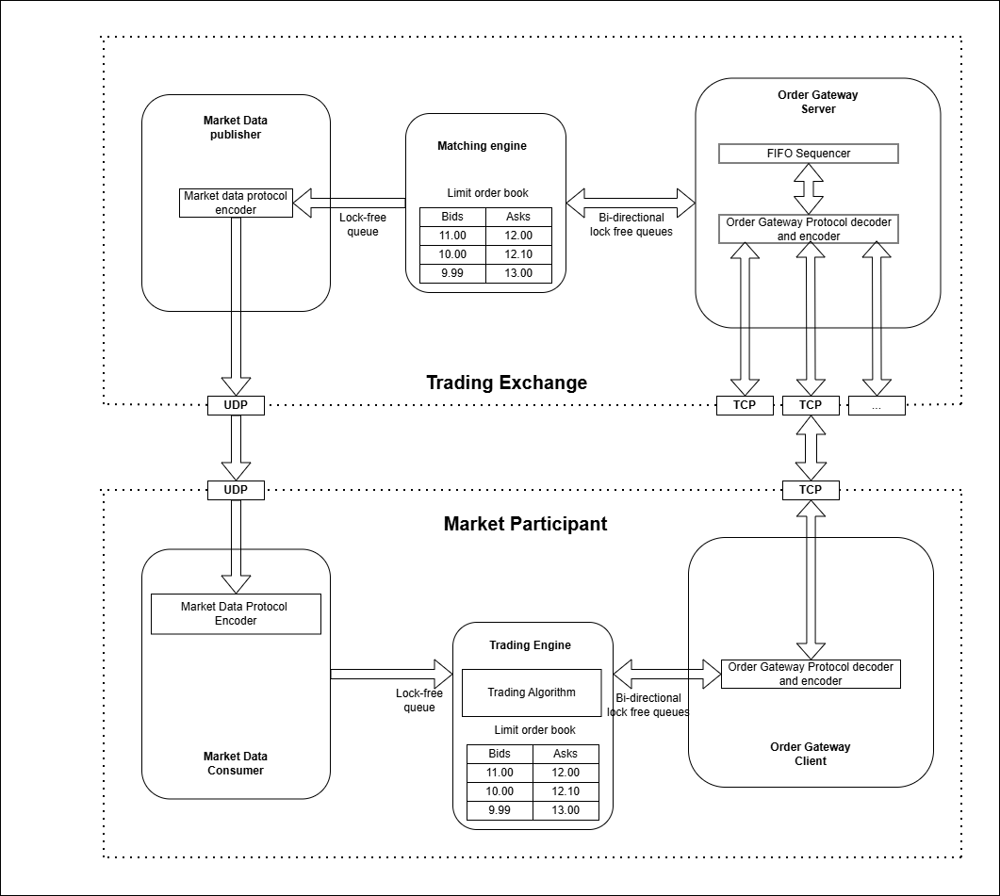
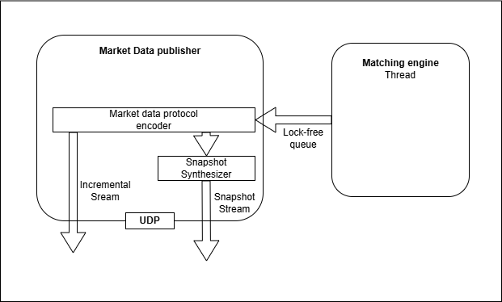
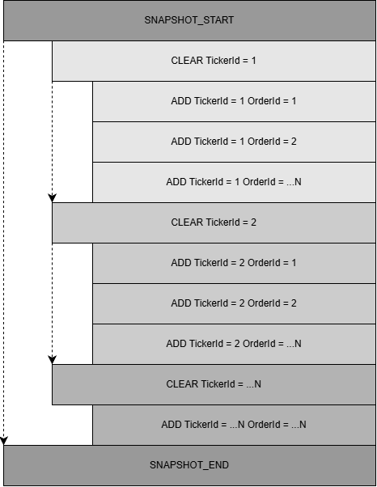
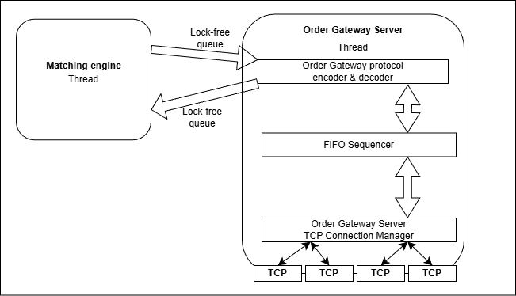

## Environment

**OS:** Ubuntu (6.6.87.2-microsoft-standard-WSL2)

**GCC:** 11.3.0

**CMake:** 3.23.2

## 1. Basic components overview

|  | 
|:--:| 
| Trading System architecture diagram |
| *Architecture diagram ispired by book "Building Low Latency Applications in C++" by Sourav Ghosh* |

**Market Data Publisher:** Broadcasts low-latency market data (ticks, order book updates) to downstream components.

**Matching Engine:** Core component responsible for ultra-low-latency order matching and order book state management.

**Order Gateway Server:** Handles inbound client orders, performs minimal validation, and forwards them to the Matching Engine.

**Market Data Consumer:** Consumes real-time market data streams for trading decisions and analytics.

**Order Gateway Encoder & Decoder:** Encodes and decodes high-performance binary messages between clients and the Order Gateway.

**Trading Engine:** Executes trading strategies and generates orders based on real-time market data.

## 2. Market Data publisher

|  | 
|:--:| 
| Market Data Publisher architecture diagram |
| *Architecture diagram ispired by book "Building Low Latency Applications in C++" by Sourav Ghosh* |

|  | 
|:--:| 
| Snapshot messages flow |
| *Architecture diagram ispired by book "Building Low Latency Applications in C++" by Sourav Ghosh* |

**2.1. Market state changes**

Closed, Pre-open, Opening, Trading

**2.2. Instrument updates**

Information about instruments avariable for trading. Contains usually instrument metadata.

**2.3. Order Updates**

Publisher uses order update messages to communicate changes to the orders in the limit order book.
- Order Add: new passive order was added to the limit order book
- Order Modify: order was modified in price, quantity or both
- Order Delete: order was deleted from order book

**2.4. Trade Messages**

This kind of messages notifies market participant that match happend in the market.
Notification can consist of many Add, Modify, Delete to communicate about full and partiall fills.

**2.5. Market Statistics**

Exchange publish those to cummunicate different stats about instrument.

## 3. Order Gateway Server

|  | 
|:--:| 
| Order Gateway Server architecture diagram |
| *Architecture diagram ispired by book "Building Low Latency Applications in C++" by Sourav Ghosh* |

The Order Gateway Server is responsible for:
- Maintaining TCP connections with exchange clients
- Receiving and parsing incoming client requests
- Performing session-level validation
- Sequencing requests before forwarding them to the Matching Engine
- Routing requests to the appropriate instrument engine

The current implementation follows a single-threaded event-loop model, ensuring deterministic processing order and avoiding synchronization overhead.

### 4. Possible improvements

#### 1. Remove Batch Sorting

std::sort(...) With sequence assignment

#### 2. Per-Instrument Routing Layer

Currently, single gateway handles all instruments and there is one Matching Engine. We should allow sharding per instrument

#### 3. Write-Ahead Logging (WAL)

Persist inbound requests before book mutation, Store last processed sequence number, Enable deterministic recovery after crash

#### 4. Add monitoring
#### 5. Add some sort of reject mechanism?
